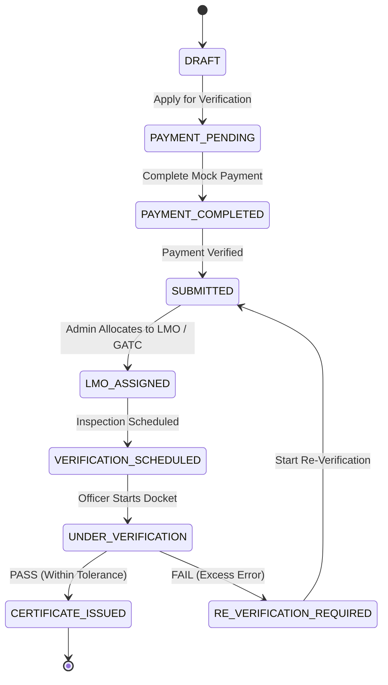

# LEGALMETRIX

> **“Unified Digital Verification & Certification Platform for Weighing & Measuring Instruments”**

**Smart India Hackathon 2026 Prototype**  
- **Problem Statement ID:** SIH26036  
- **Problem Title:** Development of an Online Verification System for Weighing and Measuring Instruments  
- **Category:** Software  

---

## ⚖️ Statutory Notice & Non-Claim Policy
> [!IMPORTANT]
> **Prototype & Demonstration Notice:**  
> This platform is a software prototype developed for demonstration purposes under SIH26036.  
> - It does **NOT** claim official government deployment or official government API integration.  
> - It does **NOT** hardcode static statutory legal limits or universal legal fees.  
> - Permissible tolerances and verification fees are configured dynamically via the platform's **Configurable Rules Engine** and **Configurable Fee Engine**, reflecting that applicable criteria vary by instrument type, accuracy class, test parameter, jurisdiction, and effective date.

---

## 🌟 Core Product Concept: One Instrument → One Connected History
Every weighing or measuring instrument maintains a permanent lifecycle identity:
- Persistent Instrument UID (`INST-2026-XXXX`), serial number, model, capacity, and accuracy class.
- Complete chronological verification history (reference values, observed values, percentage errors, applied versioned rules, and inspection remarks).
- Complete digital certificate archive (historical certificates remain permanently preserved and immutable even across multiple re-verification cycles).

---

## 🛠️ Technology Stack
- **Frontend:** React 18, Vite, Responsive CSS & Semantic Badges, Desktop & Mobile/PWA layout.
- **Backend:** Python 3.11, FastAPI, Pydantic v2, SQLAlchemy 2.0 ORM.
- **Database:** PostgreSQL primary database architecture with a zero-drift SQLite local development fallback (`legalmetrix.db`).
- **Authentication & Security:** JWT Access Tokens, direct bcrypt password hashing, Role-Based Access Control (RBAC).
- **Core Engines & Services:**
  - **Rules Engine:** 4-tier resolution hierarchy (`Exact` &rarr; `Fallback` &rarr; `Generic Default` &rarr; `Demo Fallback`).
  - **Calculation Engine:** Error evaluation ($observed - reference$) and % error calculation against active limits.
  - **Fee Engine:** Authoritative backend calculation preventing client-side fee manipulation.
  - **Certificate Integrity Service:** Deterministic SHA-256 canonical hashing and 16-character fingerprint (`XXXX-XXXX-XXXX-XXXX`).
  - **PDF & QR Service:** Professional Legal Metrology certificate PDF generator (ReportLab) and QR generator.
  - **Public Verification Service:** Privacy-safe unauthenticated verification endpoint at `/verify/{certificate_id}`.
  - **Audit Logging Service:** Append-only immutable ledger.

---

## 🔄 Exact 9-State Workflow
The system strictly enforces the mandated 9-state sequence:



*Note: In state `LMO_ASSIGNED`, the assigned authority can be either an **LMO** or a **GATC**.*

---

## 👥 Demo User Accounts & Credentials

| Role | Name / Department | Username / Email | Password | Access Level |
| :--- | :--- | :--- | :--- | :--- |
| **USER / OWNER** | Rajesh Kumar (Apex Logistics) | `owner_rajesh` / `owner@legalmetrix.demo` | `Password123!` | Instrument onboarding, verification applications, mock payment, certificates, re-verification |
| **LMO** | Inspector Vijay Salve (Legal Metrology) | `lmo_vijay` / `lmo.officer@legalmetrix.demo` | `Password123!` | Assigned field inspection docket, physical checklist, error calculation, evidence upload, PASS/FAIL |
| **GATC** | Anil Verma (Precision NABL Labs) | `gatc_anil` / `gatc.tester@legalmetrix.demo` | `Password123!` | GATC assigned laboratory docket, calibration testing, pass/fail result recording |
| **ADMIN** | Sunil Deshmukh (Directorate Admin) | `admin_sunil` / `admin@legalmetrix.demo` | `Password123!` | Verifier allocation (LMO or GATC), scheduling, Rules Engine editor, Fee Engine editor, audit trail |

*(The frontend includes a **1-click Role Switcher Bar** at the top of every page for seamless evaluation during jury demos.)*

---

## 🚀 Quick Startup Instructions

### 1. Backend Setup
From the repository root:
```bash
cd backend
python -m pip install -r requirements.txt
python -m app.seed
python -m uvicorn app.main:app --host 127.0.0.1 --port 8000 --reload
```
*Backend runs on: `http://127.0.0.1:8000` (API Docs at `http://127.0.0.1:8000/docs`)*

### 2. Frontend Setup
In a second terminal:
```bash
cd frontend
npm install
npm run dev
```
*Frontend runs on: `http://localhost:5173`*

### 3. Docker Compose (Alternative)
```bash
docker-compose up --build
```

---

## 🧪 Automated Test Suite

Run the full automated test suite using pytest:
```bash
python -m pytest -v
```

### Validation Test Cases Verified:
- **Case 1 & Case 2 (Verification Calculations):**
  - Reference: 1000, Observed: 1001.5 &rarr; Error: `+0.15%` &rarr; **PASS** under ±0.50% demo rule.
  - Reference: 1000, Observed: 1008.0 &rarr; Error: `+0.80%` &rarr; **FAIL** under ±0.50% demo rule.
- **Case 3 (Dynamic Rule Limit Adjustment):**
  - Permissible limit adjusted in Rules Engine from ±0.50% to ±0.10%. Case 1 immediately transitions to **FAIL**. Limit restored to ±0.50%.
- **Case 4 (Fee Manipulation Rejection):**
  - Frontend attempts to submit ₹10 fee; backend rejects client tampering and enforces authoritative ₹800.00.
- **Case 5 (Tamper Detection):**
  - Certificate data altered; cryptographic integrity endpoint returns `INTEGRITY_COMPROMISED`.
- **Case 6 & Case 7 (Public QR Privacy & Unauthenticated Access):**
  - `/verify/{certificate_id}` accessible without token; owner PII, GPS coordinates, and raw evidence photos are strictly withheld.
- **Case 8 & Case 9 (Certificate Immutability):**
  - `PUT /api/v1/certificates/{id}` &rarr; **HTTP 405 Method Not Allowed**.
  - `DELETE /api/v1/certificates/{id}` &rarr; **HTTP 405 Method Not Allowed**.
- **Case 10 (Failed Verification Behavior):**
  - Failed inspection yields **NO** certificate; status becomes `RE_VERIFICATION_REQUIRED`.
- **Case 11 (Re-Verification History Preservation):**
  - Re-verification initiates a new application while preserving the historical certificate and audit records intact.
- **RBAC & Workflow Transitions:**
  - Full 9-state progression verified from DRAFT to CERTIFICATE_ISSUED.
  - Users blocked from Admin & LMO endpoints (HTTP 403).
  - Payment-pending applications blocked from verifier allocation.

---

## 📱 Public QR Verification Endpoint
Scan or navigate directly to:
```
http://localhost:5173/verify/CERT-MH-001-0001
```
*(Demonstrates public verification without requiring officer login, while preserving owner privacy).*
